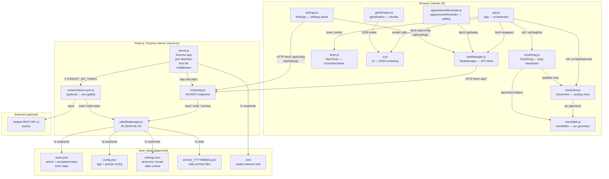

# Local Task Manager — Architecture

## Module Dependency & Data Flow

## Key Architectural Notes

| Concern | Decision |
|---|---|
| **Module system** | CommonJS (`require`) — no ESM |
| **Frontend** | Vanilla JS, no bundler, no framework — served as static assets |
| **State** | Timer state persisted server-side in `tasks.json`; survives browser refresh |
| **Single instance** | `local_data/.lock` (PID + port) — checked on startup, cleaned on exit |
| **Port** | Defaults to 3000, auto-increments up to 10 ports if in use |
| **External calls** | Only Todoist sync via axios; gated on `TODOIST_API_TOKEN` env var |
| **File I/O** | All reads/writes go through `fileManager.js` — no direct `fs` calls elsewhere |
| **No build step** | Changes to `public/js/*.js` take effect immediately on server restart |
